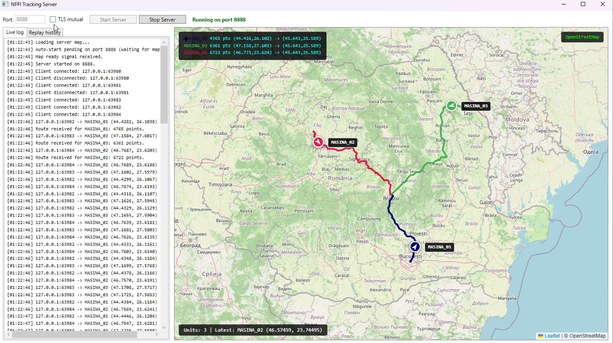
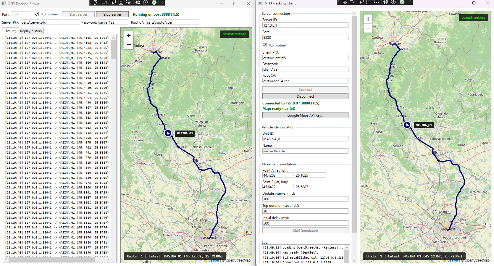

# NFFI Tracking System

A demonstration of military-grade tactical data link concepts using civilian technology stack. Real-time multi-vehicle tracking over TCP/IP, with a subset of the NATO **NFFI** (NATO Friendly Force Information, STANAG 5527) protocol transported over a simplified **JREAP-C** (Joint Range Extension Application Protocol, MIL-STD-3011) frame.

The system simulates Blue Force Tracking (BFT): multiple client vehicles report their GPS positions to a central server, which displays them live on an interactive map and stores the full history for replay.

---

## Table of Contents

- [Overview](#overview)
- [Architecture](#architecture)
- [Features](#features)
- [Requirements](#requirements)
- [Installation](#installation)
- [Usage](#usage)
- [Scripts](#scripts)
- [COM Integration](#com-integration)
- [Protocol](#protocol)
- [Database](#database)
- [Security](#security)
- [Project Structure](#project-structure)
- [Media](#media)
- [Troubleshooting](#troubleshooting)
- [Disclaimer](#disclaimer)

---

## Overview

The project demonstrates how to build a distributed tracking system using:

- **NFFI subset** - a simplified version of STANAG 5527, using JSON payloads with fields for position, identification, and status. An XML exporter (NffiSerializer.ToXml) is also provided for stricter STANAG compatibility.
- **JREAP-C subset** - a 16-byte big-endian header carrying magic, message type, sequence number, and timestamp, exactly like the real MIL-STD-3011 application header.
- **TCP/IP transport** - each NFFI message is length-prefixed and streamed over TCP.
- **Optional TLS mutual authentication** - using custom X.509 certificates generated on the fly.
- **OSRM routing** - real road-following routes instead of straight lines (uses the free public OSRM server, no API key required).
- **COM automation** - the entire stack is exposed as a COM server, allowing launching the WPF server and simulated vehicles from PowerShell or VBScript, without touching the UI.

---

## Architecture

    +-----------------+     +-----------------+     +-----------------+
    |  WPF Client     |     |  WPF Server     |     |  COM Server     |
    |  - Vehicle UI   |     |  - Live map     |     |  - TrackerCom   |
    |  - WebView2 map |     |  - Replay       |     |  - PS/VBS       |
    |  - Simulation   |     |  - SQLite       |     |  - Drives WPF   |
    +--------+--------+     +--------+--------+     +--------+--------+
             |                       |                       |
             +-----------+-----------+-----------+-----------+
                         |                       |
                         v                       v
                +-----------------+     +-----------------+
                |  NffiTracking   |     |  NffiTracking   |
                |  System.Core    |<----|  System.Shared  |
                |  - TCP server   |     |  - NFFI models  |
                |  - TCP client   |     |  - JREAP codec  |
                |  - Simulation   |     |  - TLS helpers  |
                |  - SQLite       |     |  - Config       |
                +--------+--------+     +-----------------+
                         |
                         v
                +-----------------+
                |  NffiTracking   |
                |  System.Com     |
                |  Server         |
                |  - TrackerCom   |
                |  - regsvr32     |
                +-----------------+

### Layer separation

| Layer | Type | Purpose |
|---|---|---|
| **Shared** | net8.0 class library | Data types only: NFFI models, JREAP constants, TLS options, config. No logic. |
| **Core** | net8.0 class library | All business logic: TCP server, TCP client, simulation, SQLite. No UI. Reusable by any host. |
| **Server** | net8.0-windows WPF app | Hosts Core's TcpServerService + DatabaseService, provides live map + replay UI. |
| **Client** | net8.0-windows WPF app | Hosts Core's TcpClientService + SimulationService, provides vehicle UI + map. |
| **ComServer** | net8.0-windows with EnableComHosting | Thin wrapper over Core, exposing NffiTracking.Tracker ProgID to COM. |

---

## Features

### Tracking

- Real-time NFFI position reporting over TCP
- Multi-vehicle: unlimited simultaneous clients, each with distinct color
- Length-prefixed streaming protocol (safe for large payloads)
- Optional TLS mutual authentication (client and server certificates)

### Visualization

- Interactive map with **Google Maps** or **OpenStreetMap (Leaflet)** fallback
- Automatic selection based on Google Maps API key presence
- Smooth marker animation (linear interpolation between positions)
- Arrow marker rotates with vehicle heading
- Full route drawn at simulation start (road-following via OSRM)
- Multi-route auto-fit: map zooms to encompass all active routes
- Route info overlay showing per-vehicle color, point count, A-B

### Simulation

- Vehicle simulation from point A to point B
- **OSRM routing** - follows real roads, not straight lines
- Configurable update interval and total duration
- Automatic fallback to straight line if OSRM is unreachable
- Multi-vehicle launch in parallel (single PowerShell command)

### Persistence

- SQLite database for full position history
- Indexed by (UnitId, ReportedAtUtc DESC) for fast queries
- ConnectedUnits table tracking last-seen position per unit

### Replay

- Time slider for scrubbing through recorded history
- Play/Pause with variable speed (0.5x, 1x, 2x, 4x, 10x)
- Per-unit filtering
- Reconstructs progressive trail from stored positions

### COM Automation

- Whole stack usable from PowerShell or VBScript
- regsvr32 registration with typelib export via dscom
- Scripts drive the WPF server (opens map automatically) and launch simulated vehicles in parallel

---

## Requirements

| Component | Version | Notes |
|---|---|---|
| **Visual Studio 2022** | 17.8+ | Workload: ".NET desktop development" |
| **.NET SDK** | 8.0 | Includes WPF, WebView2 runtime |
| **WebView2 Runtime** | latest | Preinstalled on Windows 10/11 recent |
| **PowerShell** | 5.1 or 7.x | Both work |
| **Internet** | - | For OSM tiles and OSRM routing |

Optional:
- **Google Maps API key** - activate Google Maps instead of OSM
- **Docker** - for local OSRM instance (offline routing)

**PowerShell note:** run-demo.ps1 works with both Windows PowerShell 5.1 and PowerShell 7. It uses reflection-based COM invocation, which bypasses the typelib issue encountered when calling .NET 8 ComHost objects from late binding.

---

## Installation

### 1. Build

Open NffiTrackingSystem.sln in Visual Studio 2022 and press **Build -> Rebuild Solution**.

### 2. Register COM server

    cd C:\Projects\NffiTrackingSystem
    scripts\install-com.bat

install-com.bat does everything:

- Auto-elevates to Administrator (one UAC prompt)
- Installs dscom globally via dotnet tool if not already present
- Unregisters any previous typelib and comhost
- Generates a fresh typelib from the ComServer assembly
- Registers the typelib
- Registers the ComHost DLL

See Scripts section for full details.

### 3. (Optional) Generate TLS certificates

    powershell -ExecutionPolicy Bypass -File .\scripts\generate-certs.ps1

Produces certs\rootCA.cer, certs\server.pfx (password: server123), certs\client.pfx (password: client123).

---

## Usage

### Scenario A - Interactive WPF (manual)

1. Open NffiTrackingSystem.sln in Visual Studio.
2. Right-click the solution -> Configure Startup Projects -> set both **Server** and **Client** to **Start**.
3. Press **F5**. Two windows open.
4. **Server**: click **Start Server** (default port 8888).
5. **Client**: enter server IP (127.0.0.1), port (8888), unit ID (MASINA_01), click **Connect**, then **Start Simulation**.
6. Watch the vehicle move from point A to point B along real roads.
7. For a second vehicle: launch another Client instance with a different unit ID (MASINA_02).

### Scenario B - Automated via COM (one-shot)

Prerequisite: COM server registered via scripts\install-com.bat.

    cd C:\Projects\NffiTrackingSystem
    .\scripts\run-demo.ps1

This will:

1. Kill any lingering server processes
2. Launch the WPF server with --autostart 8888 (map opens automatically)
3. Wait for the map to signal "ready" via WebView2 handshake
4. Launch 3 simulated vehicles in parallel (Bucharest, Cluj, Iasi -> Brasov)
5. Display live progress in the console
6. Shut down the server when all vehicles arrive

You will see the WPF window with the map, three colored route lines, and three markers moving along them.

Options:

| Parameter | Effect |
|---|---|
| -DurationSec 60 | Simulate for 60 seconds |
| -Port 9999 | Use a different port |
| -Headless | No WPF, only headless server via COM |
| -KeepServer | Leave server running after demo |

### Scenario C - Manual COM scripting

Because .NET 8 ComHost objects cannot be called directly from PowerShell
(typelib issue, error `0x80131165`), all COM calls must go through a
small reflection helper:

    # Reflection helper for calling COM methods
    if (-not ("ComHelper" -as [type])) {
        Add-Type -TypeDefinition @"
    using System;
    using System.Reflection;
    public static class ComHelper {
        public static object Invoke(object comObj, string method, params object[] args) {
            return comObj.GetType().InvokeMember(method,
                BindingFlags.InvokeMethod, null, comObj, args ?? new object[0]);
        }
    }
    "@
    }

    # Create the COM object
    $tracker = New-Object -ComObject NffiTracking.Tracker
    [ComHelper]::Invoke($tracker, "GetVersion")

    # Start a headless server in-process
    [ComHelper]::Invoke($tracker, "StartServer", @(8888, ".\demo.db"))

    # Launch vehicles
    [ComHelper]::Invoke($tracker, "AddVehicle", @(
        "127.0.0.1", 8888, "MASINA_01",
        44.4268, 26.1025, 45.6427, 25.5887, 100, 30))
    [ComHelper]::Invoke($tracker, "AddVehicle", @(
        "127.0.0.1", 8888, "MASINA_02",
        46.7712, 23.6236, 45.6427, 25.5887, 100, 30))

    # Monitor
    Start-Sleep -Seconds 32

    # Query
    [ComHelper]::Invoke($tracker, "GetActiveVehicles")
    [ComHelper]::Invoke($tracker, "GetLastPosition", @("MASINA_01"))

    # Cleanup
    [ComHelper]::Invoke($tracker, "StopAll")
    [System.Runtime.InteropServices.Marshal]::ReleaseComObject($tracker) | Out-Null
### Replay history

In the WPF Server:

1. Tab **Replay history**
2. Select unit (or "all units")
3. Click **Load history**
4. Use **Play/Pause** and the slider to scrub through recorded positions
5. Adjust speed via the combo box

---

## Scripts

The scripts/ folder contains three helper scripts.

### install-com.bat

Registers the COM server with Windows.

**What it does:**

1. Self-elevates to Administrator (one UAC prompt)
2. Locates dscom.exe (installs it globally via dotnet tool if missing)
3. Unregisters any previous typelib (dscom tlbunregister)
4. Unregisters any previous comhost (regsvr32 /u)
5. Generates fresh typelib from the assembly (dscom tlbexport)
6. Registers the typelib (dscom tlbregister)
7. Registers the comhost (regsvr32)

**When to run:**

- Once after the first build
- After any modification to the COM interface (ITrackerCom)
- After changing TrackerCom.cs

**How to run:**

    cd C:\Projects\NffiTrackingSystem
    scripts\install-com.bat

### run-demo.ps1

Launches the full demo - WPF server + 3 simulated vehicles - from a single command.

**What it does:**

1. Kills any lingering server processes
2. Launches the WPF server with --autostart 8888 (map opens automatically)
3. Waits for the map to signal "ready" via WebView2 handshake
4. Launches 3 vehicles in parallel: Bucharest, Cluj-Napoca, Iasi -> Brasov
5. Polls GetActiveVehicles() every second and prints progress
6. Calls StopAll() and shuts down the WPF server when all vehicles arrive

**How to run:**

    cd C:\Projects\NffiTrackingSystem
    .\scripts\run-demo.ps1

**Works with both Windows PowerShell 5.1 and PowerShell 7.**

**Parameters:**

| Parameter | Default | Effect |
|---|---|---|
| -Port | 8888 | TCP port for the server |
| -DurationSec | 30 | Simulated trip duration, in seconds |
| -Headless | off | Do not start WPF; run only headless server via COM |
| -KeepServer | off | Leave the WPF server running after demo ends |

### generate-certs.ps1

Generates a self-signed X.509 PKI for the optional TLS mutual authentication feature.

**What it produces:**

- certs/rootCA.cer - root CA certificate (no password)
- certs/server.pfx - server certificate + private key (password: server123)
- certs/client.pfx - client certificate + private key (password: client123)

**How to run:**

    cd C:\Projects\NffiTrackingSystem
    powershell -ExecutionPolicy Bypass -File .\scripts\generate-certs.ps1

**Usage in apps:**

- Server -> check **TLS mutual**, browse to certs\server.pfx, password server123
- Client -> check **TLS mutual**, browse to certs\client.pfx, password client123

---

## COM Integration

The ComServer exposes a dual-interface COM object with ProgID NffiTracking.Tracker.

### Interface

    public interface ITrackerCom
    {
        string GetVersion();
        void StartServer(int port, string dbPath);
        void StopServer();
        void AddVehicle(string host, int port, string unitId,
                        double latA, double lonA, double latB, double lonB,
                        int intervalMs, int durationSec);
        string[] GetActiveVehicles();
        string GetLastPosition(string unitId);
        void StopVehicle(string unitId);
        void StopAll();
    }

### Unregistration

    regsvr32 /u NffiTrackingSystem.ComServer.comhost.dll  (as admin)
    dscom tlbunregister NffiTrackingSystem.ComServer.tlb  (as admin)

### COM invocation from PowerShell

The scripts use reflection-based invocation (GetType().InvokeMember(...)) to call COM methods, bypassing a well-known typelib lookup issue affecting .NET 8 ComHost objects. This works identically in PowerShell 5.1 and PowerShell 7.

### VBScript invocation

VBScript works natively - no reflection needed, no typelib issues:

    Set tracker = CreateObject("NffiTracking.Tracker")
    WScript.Echo tracker.GetVersion()
    tracker.StartServer 8888, ".\vbs_demo.db"
    tracker.AddVehicle "127.0.0.1", 8888, "MASINA_01", 44.4268, 26.1025, 45.6427, 25.5887, 100, 5
    WScript.Sleep 6000
    WScript.Echo tracker.GetLastPosition("MASINA_01")
    tracker.StopAll

---

## Protocol

### JREAP-C frame (simplified, 16 bytes)

All multi-byte fields are **big-endian**.

| Offset | Size | Field | Value |
|---|---|---|---|
| 0 | 4 | Magic | 0x4A524541 ("JREA") |
| 4 | 2 | MessageType | 0x0001 = NFFI PPLI |
| 6 | 2 | SequenceNumber | Increments per message |
| 8 | 8 | TimestampUnixMs | Milliseconds since Unix epoch |

### Wire format per message

    [JREAP-C header: 16 bytes]
    [Payload length: 4 bytes, little-endian]
    [Payload: NFFI JSON, UTF-8]

### NFFI payload example

    {
      "positionalData": {
        "coordinates": { "latitude": 44.4268, "longitude": 26.1025, "altitude": 85 },
        "velocity": 55.5,
        "heading": 320.0
      },
      "identification": { "unitId": "MASINA_01", "name": "Recon Vehicle" },
      "status": {
        "operationalStatus": "OPERATIONAL",
        "timestampUtc": "2026-09-13T14:32:45.123Z"
      },
      "routePoints": [
        { "lat": 44.4268, "lon": 26.1025 },
        { "lat": 44.5079, "lon": 26.0569 }
      ],
      "updateIntervalMs": 100
    }

routePoints is populated only on the first message of a trip.

---

## Database

SQLite database nffi_tracking.db is created next to the server executable.

### Schema

    CREATE TABLE NffiPositions (
        Id INTEGER PRIMARY KEY AUTOINCREMENT,
        UnitId TEXT NOT NULL,
        UnitName TEXT,
        Latitude REAL NOT NULL,
        Longitude REAL NOT NULL,
        Altitude REAL,
        Velocity REAL,
        Heading REAL,
        OperationalStatus TEXT,
        ReportedAtUtc TEXT NOT NULL,
        ReceivedAtUtc TEXT NOT NULL,
        JreapSequenceNumber INTEGER,
        RawXml TEXT
    );

    CREATE INDEX IX_NffiPositions_UnitId_ReportedAt
        ON NffiPositions (UnitId, ReportedAtUtc DESC);

    CREATE TABLE ConnectedUnits (
        UnitId TEXT PRIMARY KEY,
        UnitName TEXT,
        LastSeenUtc TEXT NOT NULL,
        LastLatitude REAL,
        LastLongitude REAL
    );

---

## Security

### TLS mutual authentication

Optional. When enabled, both server and client verify each other's certificates against a shared root CA.

**Server side:**

    new TlsOptions {
        Enabled = true,
        ServerCertificatePath = "certs\\server.pfx",
        ServerCertificatePassword = "server123",
        RootCaCertificatePath = "certs\\rootCA.cer",
        RequireClientCertificate = true
    }

**Client side:**

    new TlsOptions {
        Enabled = true,
        ClientCertificatePath = "certs\\client.pfx",
        ClientCertificatePassword = "client123",
        RootCaCertificatePath = "certs\\rootCA.cer"
    }

TLS 1.2 and 1.3 are supported.

### Threat model note

This is a demonstration. Real military data links add frequency hopping, MACs, secure sequence numbers, anti-jam waveforms, and EMCON procedures. None of these are implemented.

---

## Project Structure

    NffiTrackingSystem/
    +-- NffiTrackingSystem.sln
    +-- README.md
    +-- .gitignore
    +-- Database/
    |   +-- schema.sql
    +-- scripts/
    |   +-- generate-certs.ps1
    |   +-- install-com.bat
    |   +-- run-demo.ps1
    +-- NffiTrackingSystem.Shared/
    |   +-- Models/
    |   +-- Protocol/
    |   +-- Config/
    |   +-- Security/
    +-- NffiTrackingSystem.Core/
    |   +-- Server/
    |   +-- Client/
    +-- NffiTrackingSystem.Server/
    |   +-- MainWindow.xaml(.cs)
    |   +-- wwwroot/map.html
    +-- NffiTrackingSystem.Client/
    |   +-- MainWindow.xaml(.cs)
    |   +-- Views/
    |   +-- Services/
    |   +-- wwwroot/map.html
    +-- NffiTrackingSystem.ComServer/
        +-- NffiTrackingSystem.ComServer.csproj
        +-- TrackerCom.cs

---

## Media

All screenshots, GIFs, and videos live in the `docs/` folder.

### docs/ structure

    docs/
    ├── images/                (PNG + GIF)
    └── videos/                (MP4)

### docs/images/

| File | Purpose |
|---|---|
| map-with-routes.png | WPF server with 3 colored routes and markers |
| com-powershell.png | PowerShell output of run-demo.ps1 |
| wpf-client.png | WPF client UI |

### docs/videos/

| File | Purpose |
|---|---|
| hero-demo.mp4 | Main demo video (Bucharest, Cluj, Iasi -> Brasov) |

### Preview

| Map with routes | WPF client |
|---|---|
|  |  |

### Full demo video

- [Watch on YouTube](https://www.youtube.com/watch?v=cGClc0Im1js) - full demo, HD streaming
- [Download MP4](docs/videos/hero-demo.mp4) - local playback, no account needed

---

## Troubleshooting

### COM registration

| Symptom | Cause | Fix |
|---|---|---|
| 0x80131165 typelib not registered | Late binding against .NET 8 ComHost | Use reflection invocation, or VBScript |
| 0x80070005 access denied | regsvr32 not elevated | Run install-com.bat or open CMD as Administrator |
| DLL is locked by pwsh.exe | COM DLL still loaded in PowerShell | Close all PowerShell windows, then rebuild |
| Cannot convert __ComObject | Trying a direct interface cast | Use reflection |

### Map issues

| Symptom | Cause | Fix |
|---|---|---|
| Route not drawn on server | Server receives positions but not routePoints | Check UseOsrm = true in TrackerCom.cs |
| Straight-line routes | OSRM unreachable | Check internet; OSRM public server may be down |
| Map blank | WebView2 runtime missing | Install WebView2 Runtime |
| Only markers, no lines | map.html in bin is stale | Rebuild (CopyToOutputDirectory=Always) |
| Vehicles jump back and forth | Animation starts from stale position | Linear interpolation in animateMarker |

### Rebuild fails with file lock

    Get-Process pwsh, powershell -ErrorAction SilentlyContinue |
        Where-Object { $_.Id -ne $PID } |
        Stop-Process -Force

Then **Build -> Rebuild Solution**.

---

## Disclaimer

**This software is an educational demonstration.** It is not certified for operational military use. The NFFI / JREAP-C implementations are simplified subsets; for real deployments, refer to:

- **STANAG 5527** (NFFI)
- **MIL-STD-3011** (JREAP)
- **STANAG 5516** (Link 16 / TADIL-J)

Do not transmit classified information over this system. Do not use in live operations.